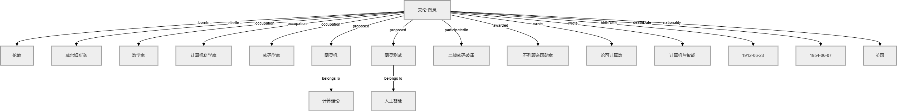

# turing-knowledge-graph
# 图灵知识图谱（Turing Knowledge Graph）

本项目依据《知识工程》课程内容，构建关于艾伦·图灵的知识图谱。包含人物、地点、概念、事件、奖项、著作等实体及其关系。

## 可视化

## 数据格式
- RDF/Turtle: `turing.ttl`
- CSV三元组: `triples.csv`

## 构建方法
遵循语义网规范，采用RDFS/OWL定义本体，实例层以三元组形式存储。
graph TD
  classDef person fill:#a3d5f0,stroke:#333,stroke-width:2px;
  classDef concept fill:#f9e6b3,stroke:#333;
  classDef location fill:#c2e0c2,stroke:#333;
  classDef event fill:#f5b7b1,stroke:#333;
  classDef award fill:#d7bde2,stroke:#333;
  classDef work fill:#f9e79f,stroke:#333;

  Turing["艾伦·图灵"]:::person
  London["伦敦"]:::location
  Wilmslow["威尔姆斯洛"]:::location
  Mathematician["数学家"]:::concept
  ComputerScientist["计算机科学家"]:::concept
  Cryptanalyst["密码学家"]:::concept
  TuringMachine["图灵机"]:::concept
  TuringTest["图灵测试"]:::concept
  Codebreaking["二战密码破译"]:::event
  OBE["不列颠帝国勋章"]:::award
  OnComputable["论可计算数"]:::work
  OnIntelligence["计算机与智能"]:::work
  ComputationTheory["计算理论"]:::concept
  AI["人工智能"]:::concept
  DateBirth["1912-06-23"]
  DateDeath["1954-06-07"]
  Nationality["英国"]

  Turing -- birthDate --> DateBirth
  Turing -- bornIn --> London
  Turing -- deathDate --> DateDeath
  Turing -- diedIn --> Wilmslow
  Turing -- nationality --> Nationality
  Turing -- occupation --> Mathematician
  Turing -- occupation --> ComputerScientist
  Turing -- occupation --> Cryptanalyst
  Turing -- proposed --> TuringMachine
  Turing -- proposed --> TuringTest
  Turing -- participatedIn --> Codebreaking
  Turing -- awarded --> OBE
  Turing -- wrote --> OnComputable
  Turing -- wrote --> OnIntelligence
  TuringMachine -- belongsTo --> ComputationTheory
  TuringTest -- belongsTo --> AI
